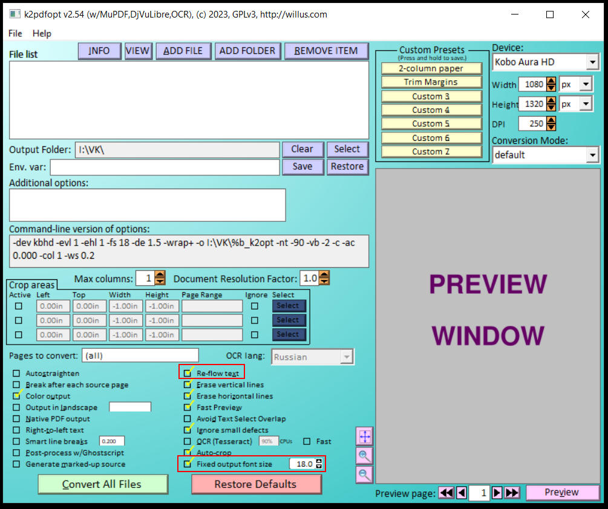

# Resize PDF for e-readers

Guide to optimizing PDFs for small e-reader screens with k2pdfopt. Fixes small text and translates content for better readability - even in non-OCR (image-based) PDFs.  

## Why it's needed.  
- E-readers (e.g. Kindle, Kobo, etc.) often display PDFs with text that is too small.  
- k2pdfopt intelligently changes the text and font size while preserving the formatting.  
- Works without OCR (processes scanned/imaged PDF files).

## Requirements 
1. Operating system: Windows.  
2. Programs: k2pdfopt installed (instructions below)  
3. Internet access to download utilities and PDF file.  
4. Administrator rights (requires installation in system folders).  
5. Disk: enough free space for files (high resolution PDFs can be large).

## Instructions 
- Download k2pdfopt from the latest release https://willus.com/k2pdfopt/download/  
[Mirror on GitHub](https://github.com/gamelton/Resize-PDF-for-eReader/releases/download/v1.0/k2pdfopt.exe)
- Extract to I:\VK\k2pdfopt\ folder (or other folder).
- Run k2pdfopt.exe
- Click Add file and add PDF file
- Press Select and select the folder to save the new PDF to.
- Select Kobo Aura HD in Device
- Check `Re-flow text` and `Fixed output font size: 18`.
- Click Convert all files

 
